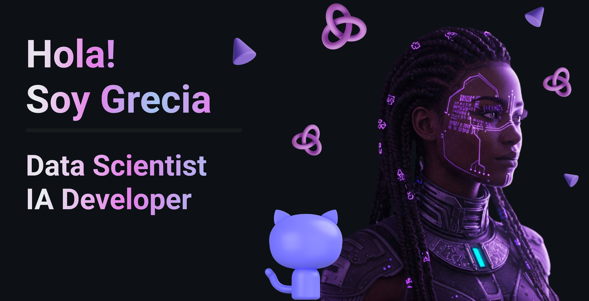

### Data Scientist en formación, analista de datos y desarrolladora de IA

*Sumergiéndome en proyectos que aprovechan el poder de los datos, el análisis predictivo y el aprendizaje automático para obtener información valiosa y transformar datos en decisiones estratégicas y soluciones innovadoras.*

Mi camino profesional combina un conjunto de habilidades personales y técnicas con una clara inclinación hacia la solución de problemas de negocio y sociales. Desde una visión transformadora pienso en cómo la IA puede ser una herramienta para abordar algunas de las cuestiones más acuciantes de nuestra era: economía, equidad, sostenibilidad medioambiental, educación, salud, etc. No es solo la tecnología en sí misma lo que me apasiona, sino cómo la puedo utilizar.

<!-- Tech Stack -->

## 💻 Tech Stack ⚡
                             

  
## 📊 GitHub Stats
<!-- Stats -->

  
    
  
    

<!--
**GreciaLH/GreciaLH** is a ✨ _special_ ✨ repository because its `README.md` (this file) appears on your GitHub profile.

Here are some ideas to get you started:

- 🔭 I’m currently working on ...
- 🌱 I’m currently learning ...
- 👯 I’m looking to collaborate on ...
- 🤔 I’m looking for help with ...
- 💬 Ask me about ...
- 📫 How to reach me: ...
- 😄 Pronouns: ...
- ⚡ Fun fact: ...
-->
